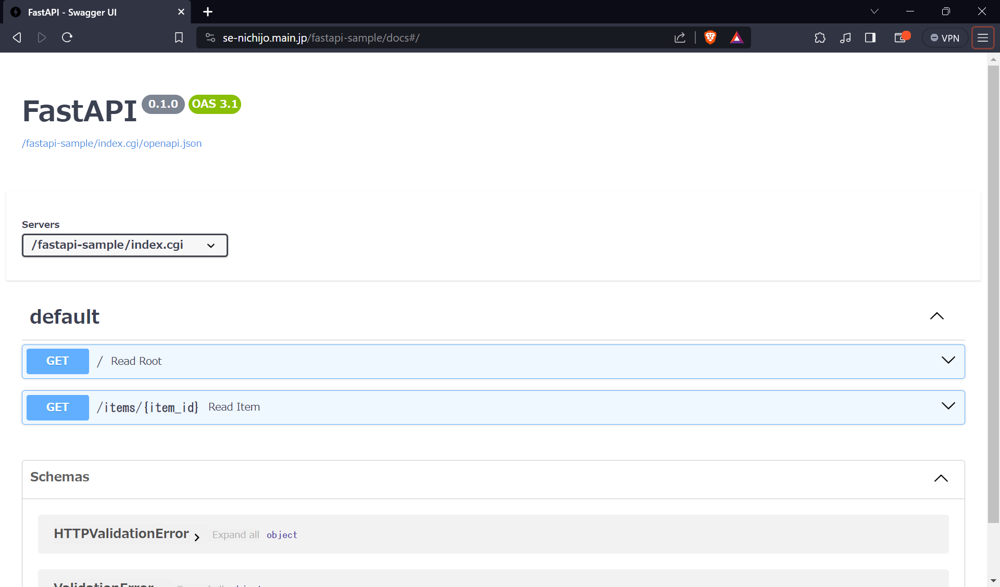

# LolipopをFastAPIを実行する方法
## 前提条件
* SSHが使用できること

## 手順
1. Gitでクローンする
```bash
# Apacheのフォルダに移動する
cd /home/users/1/main.jp-se-nichijo/web
# Gitをクローン
git clone https://github.com/kenjinagai/fastapi-sample.git
```
2. fastapi-sampleに移動する
```bash
cd fastapi-sample
```
3. 仮想環境を作成
```bash
python3 -m venv fast-api-venv
source fast-api-venv/bin/activate
python3 -m pip install -r requirements.txt
```
4. ファイルパスを変更する
```bash
vi index.cgi
```
```bash
#!/home/users/1/main.jp-se-nichijo/web/fastapi-sample/fast-api-venv/bin/python3
from wsgiref.handlers import CGIHandler
from fastapi_sample.main import wsgi_app
CGIHandler().run(wsgi_app)
```
5. 実行権限を追加する
```bash
chmod a+x index.cgi
```

## アクセスする
* https://se-nichijo.main.jp/fastapi-sample/docs#/

